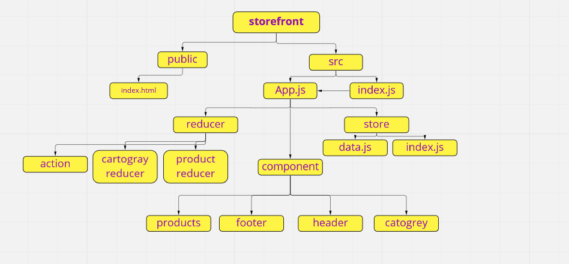

# storefront

## Application State with Redux

Virtual Store Phase 1:  create an e-Commerce storefront using React with Redux, coupled with live API server.

[PR link](https://github.com/salammustafa728/storefront/pull/1)

[Deploy Link](https://storefront-app-salam.netlify.app/)

Virtual Store Phase 2: breaking up the store into multiple reducers and sharing functionality/data between components

[PR link](https://github.com/salammustafa728/storefront/pull/2)

# UML 

